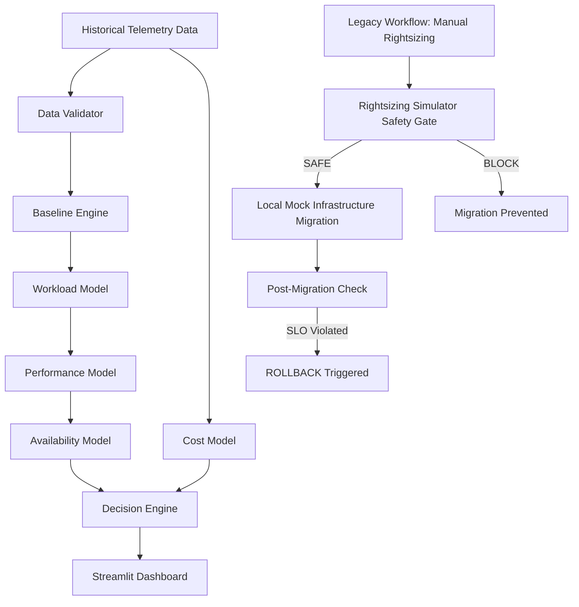
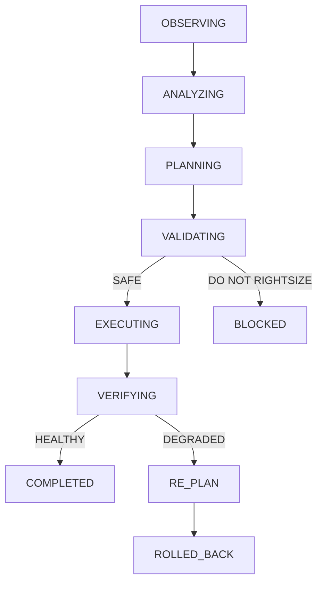

# Architecture

## Rightsizing Simulator Architecture

### Agentic Intelligence Layer

The system has been upgraded to a 9/10 Agentic Maturity level by introducing an autonomous `RightsizingAgent`. This agent controls the end-to-end rightsizing lifecycle without bypassing any safety thresholds. 

The agent operates as a finite state machine:
`OBSERVING -> ANALYZING -> PLANNING -> VALIDATING -> EXECUTING -> VERIFYING -> COMPLETED / ROLLED_BACK / BLOCKED`

### Components

1. **Agent Tools (`AgentTools`)**: Exposes programmatic functions (e.g. `load_telemetry`, `simulate_rightsizing`, `execute_local_migration`, `run_health_check`) to the agent, shielding the underlying deterministic implementation.
2. **Rightsizing Agent (`RightsizingAgent`)**: Navigates the state machine autonomously. It handles risk scoring, trace logging, and programmatic rollback handling upon encountering failure.
3. **Safety Engine (`DecisionEngine`)**: Remained immutable. The agent cannot override or bypass it.
4. **Mock Infrastructure (`LocalInfrastructure`)**: Holds an in-memory representation of instance types.
5. **Audit Ledger (`AuditLog`)**: Records every autonomous decision made by the agent for compliance and observability.
