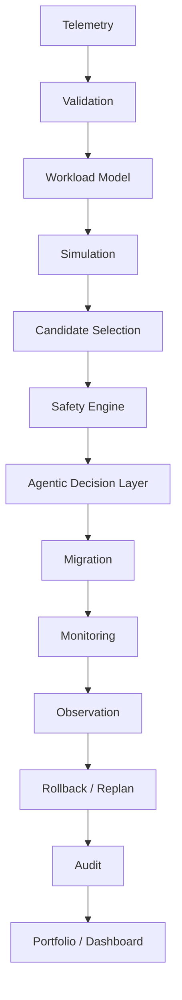

# Architecture

## Overview
The system relies on a pipelined process evaluating telemetry into concrete decisions executed against a local mock infrastructure state. 

## Data Flow Diagram

## Description
1. **Telemetry**: Raw environment metrics are loaded.
2. **Validation**: Edge cases (missing data, negative values) are scrubbed.
3. **Workload Model**: Transforms metrics based on seasonal/peak parameters.
4. **Simulation**: Projects expected latencies and resource saturation on a candidate instance.
5. **Candidate Selection**: Generates a ranking of viable cheaper instances.
6. **Safety Engine**: The final gatekeeper. Emits `DO NOT RIGHTSIZE` if constraints break.
7. **Agentic Decision Layer**: The Agent traverses state (`OBSERVE` -> `ANALYZE` -> `PLAN` etc.).
8. **Migration**: Updates the `LocalInfrastructure` mock environment state.
9. **Monitoring & Observation**: Extracts immediate simulated telemetry from the new instance state.
10. **Rollback / Replan**: If degraded, gracefully restores state.
11. **Audit**: Logs to `dashboard_audit_log.csv`.
12. **Portfolio / Dashboard**: Visualizes outcomes to stakeholders.
